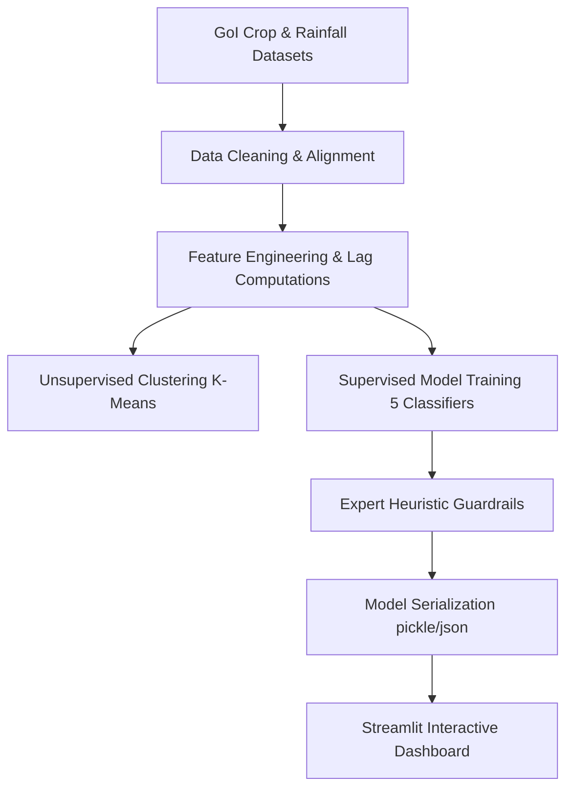

# Farmer Decision Intelligence: Predicting Crop Switching Behaviour in Andhra Pradesh
## Project Report

---

## 1. Introduction and Motivation

### 1.1 Application Context: What is the Platform?
The **Farmer Decision Intelligence Platform** is a data-driven advisory tool designed for the agricultural ecosystem of Andhra Pradesh. At its core, the platform combines historical agricultural statistics (1997–2014) and rainfall records with predictive machine learning models to forecast **crop switching** behavior. 

Crop switching refers to a farmer's decision to change the primary crop cultivated on their land from one season or year to the next. The application makes this intelligence accessible via an interactive Streamlit dashboard featuring a **Live Farmer Decision Simulator**. Users (such as farmers or agricultural extension officers) can select a district and season, input expected rainfall and cultivation metrics, and instantly receive:
*   A calibrated crop switching risk probability (Low, Medium, or High).
*   Dynamic risk categorization adjusted by expert meteorological guardrails (e.g., automated high-risk overrides during extreme drought or flood conditions).
*   Action-oriented farming recommendations to guide next-season crop planning.

### 1.2 Why Crop Switching Prediction Matters
In traditional farming, decisions about what crop to plant are often based on historical habits, emotions, or reactive responses to the previous year's success or failure. However, in an era of rapid climate shifts and volatile markets, this reactive approach introduces immense risk. 

Predicting crop switching behavior matters because it acts as an early-warning indicator:
*   **Preventing Reactive Mistakes:** If farmers reactively switch to a popular crop simultaneously (e.g., everyone switching to Cotton after a bad Rice harvest), it leads to market glut, causing crop prices to crash.
*   **Optimizing Resource Demands:** Significant crop switches alter the local demand for water, specific seeds, fertilizers, and harvesting equipment. Forecasting these shifts helps stabilize resources.
*   **Adapting to Extreme Weather:** Climate stress (like a dry monsoon season) forces crop switching. Predicting which districts are most vulnerable to switching helps coordinate relief and adaptive measures before crop failure occurs.

### 1.3 Relevance to Farmers and Agriculture
The relevance of this platform spans across the entire agricultural value chain:
*   **Empowering Farmers with Proactive Risk Analysis:** Rather than finding out a crop is unsustainable mid-season, farmers can use the simulator to check the stability of their planned crops against expected weather forecasts. If the system indicates a "High Risk" of switching due to predicted drought, the farmer is advised to plant drought-resistant varieties (like millets or pulses) or set up alternative irrigation beforehand.
*   **Supporting Local Agricultural Administration:** Government agencies and seed cooperatives can use district-level risk forecasts to manage inventory. If the platform predicts a high probability of switching away from water-intensive crops in a district like Kuddapah, authorities can pre-stock alternative seeds in local cooperative stores to meet the sudden shift in demand.
*   **Stabilizing Food Security and Crop Yields:** By replacing guesswork with decision intelligence, the platform helps maintain balanced crop diversity, prevents regional food shortages, and protects farmer livelihoods from avoidable failures.

---

## 2. Problem Statement

### 2.1 The Core Agricultural Challenge
Farmers in Andhra Pradesh operate in a highly unpredictable environment. When a crop experiences poor productivity (yield decline) or severe weather stresses (droughts or excessive rain), farmers are forced to adapt by changing their primary crop for the next season—a behavior known as **crop switching**. 

However, there is a lack of tools that can predict these switches in advance. Because agriculture varies heavily by region (13 distinct districts) and timing (seasons like *Kharif*, *Rabi*, or *Whole Year*), we need a localized predictive model. Without it, crop switching remains reactive, leading to sudden seed shortages, supply chain blockages, or unguided decisions by farmers that could result in subsequent crop failures.

### 2.2 The Technical Machine Learning Task
The technical objective of this project is to build an end-to-end Machine Learning pipeline that answers a specific question: 
> *Given a specific district, season, current crop metrics, and expected rainfall, is the dominant crop in danger of being switched in the upcoming year?*

We frame this as a **supervised binary classification problem**:
*   **Target Variable (`Switched`):** Predict a label of $1$ (if the dominant crop grown in a district-season changes in the subsequent year) or $0$ (if the crop remains the same).
*   **Addressing Class Imbalance:** Historically, crop switching is a minority event, occurring in roughly **20% of records** (a 4:1 imbalance). The model must be trained to accurately identify the minority class (`Switched = 1`) without over-predicting the majority class.

### 2.3 Input Features (Model Predictors)
To make accurate predictions, the model utilizes 16 engineered features categorized into four areas:
1.  **Spatial-Temporal Context:** Geographic location (`District_enc`) and crop season (`Season_enc`).
2.  **Scale & Production Metrics:** Active cultivated land size (`Area`), crop output (`Production`), and land productivity (`Yield`). We also apply log transforms (`Area_log`, `Production_log`, `Yield_log`) to smooth out extreme value differences between small-scale and large-scale districts.
3.  **Historical Momentum (Lag Features):** Previous year's cultivated area (`Prev_Area`), previous year's yield (`Prev_Yield`), and year-over-year shifts (`Area_change`, `Yield_change`).
4.  **Climate Stresses & Interactions:** Total expected rainfall (`annual_rainfall`), rainfall deviation from the historical district average (`rainfall_deviation`), and interaction features (`Area_x_Rain`, `Yield_x_Rain`) to capture how scale interacts with weather stress.

### 2.4 Expected Outcome & Output Solutions
The system delivers a three-part output solution:
*   **Calibrated Risk Probability:** Rather than a simple "Yes/No", the model outputs a probability score from $0\%$ to $100\%$. This is mapped into three distinct risk tiers: **Low Risk** ($\le 40\%$), **Medium Risk** ($40\% - 70\%$), and **High Risk** ($> 70\%$).
*   **Expert Meteorological Guardrails:** Under extreme weather anomalies (such as a severe drought where expected rainfall drops below 70% of normal, or severe flooding where expected rainfall exceeds 140% of normal), rule-based overrides automatically escalate the risk level, ensuring safety even in cases where historical training data is sparse.
*   **Actionable Advisory Recommendations:** The system translates the final risk level into localized farming advice (e.g., suggesting water-efficient crop options or warning of impending weather stress) accessible through a live interactive simulator.

---

## 3. Dataset Understanding

### 3.1 Data Integration & Cleaning Strategy
The dataset is built by merging three historical public datasets from the Government of India (GoI):
1.  **Crop Production Statistics (data.gov.in):** Records of district-level crop varieties, seasons, cultivated area (hectares), and production (metric tonnes).
2.  **Rainfall in India (1901–2015):** Monthly and annual rainfall records grouped by meteorological subdivisions.
3.  **Districtwise Normal Rainfall:** Reference baseline averages representing the "normal" expected rainfall for each district.

To ensure data quality, we filtered the records specifically for **Andhra Pradesh** between **1997 and 2014**. We resolved district name inconsistencies (e.g., matching `KADAPA` to `KUDDAPAH`, `VISAKHAPATANAM` to `VISAKHAPATNAM`, and `SPSR NELLORE` to `NELLORE`) to prevent records from dropping during the merge. After calculating crop productivity (`Yield = Production / Area`) and removing missing values, we grouped the data by district, season, and year to identify the dominant crop (the crop with the largest cultivated area). The final preprocessed dataset contains **688 high-fidelity records**.

---

### 3.2 Dataset Structure & Field Definitions
The merged dataset contains 10 primary fields, representing geographic, temporal, agricultural, and climate parameters:

| Field Name | Data Type | Description | Key Characteristic |
| :--- | :--- | :--- | :--- |
| `District_Name` | Categorical | The target district in Andhra Pradesh (e.g., Anantapur, Chittoor, Kuddapah). | 13 districts represented. |
| `Crop_Year` | Integer | The year of observation. | Covers a 17-year span (1997–2014). |
| `Season` | Categorical | The agricultural season. | Classified as `Kharif` (monsoon), `Rabi` (winter), or `Whole Year`. |
| `Crop` | Categorical | The dominant crop cultivated in that district-season. | Represents 68 unique crop types. |
| `Area` | Float (hectares) | Total land area used for cultivating the crop. | Range: small-scale plots to large regional fields. |
| `Production` | Float (tonnes) | Total volume of crop harvested. | Heavily correlated with cultivated area. |
| `Yield` | Float (tonnes/ha) | Crop productivity metric, calculated as $\text{Production} / \text{Area}$. | Essential proxy for soil/crop health. |
| `annual_rainfall` | Float (mm) | Actual annual rainfall recorded for the subdivision. | Captures yearly wet/dry cycles. |
| `rainfall_deviation` | Float (mm) | The deviation of actual rainfall from the district's normal average. | Negative values indicate drought; positive indicates excess rain. |
| `Switched` | Binary ($0$ or $1$) | **Target Label.** $1$ if the dominant crop changes in the subsequent year; $0$ if it remains the same. | Denotes farmer switching decisions. |

---

### 3.3 Key Exploratory Insights
Analyzing the dataset reveals several important characteristics about crop switching behavior in Andhra Pradesh:

*   **The 20% Switching Rate (Class Imbalance):** The dataset shows an overall **crop switching rate of 20.06%**. This means that in 80% of cases, farmers prefer crop stability (`Switched = 0`) year-over-year. This creates a natural 4:1 class imbalance that our machine learning models must account for.
*   **District Vulnerability Profiles:** 
    *   **Most Volatile:** **Kuddapah (Kadapa)** shows the highest frequency of crop switching. This is a region highly sensitive to weather variations, where farmers frequently adapt to shifting monsoon patterns.
    *   **Most Stable:** **Chittoor** exhibits the lowest crop switching rate, showing strong crop consistency.
*   **Crop Susceptibility (High Risk Crops):** **Sugarcane** is the crop most frequently switched away from. Sugarcane requires huge amounts of water and has a long growth cycle; when rainfall deviations are negative (drought), sugarcane becomes unsustainable, forcing farmers to switch to hardier crops.
*   **Rainfall Deviations as a Driver:** Exploratory boxplots reveal that crop switching occurs more frequently in years with negative rainfall deviations (drought stress) or severe positive deviations (flooding/excess rain), confirming that water availability is a major catalyst for farmer decisions.

---

## 4. Methodology

### 4.1 Overall Pipeline Workflow
To build a reliable predictive system, we designed an end-to-end data science pipeline. The workflow consists of six logical stages, moving from raw data to an interactive deployment:

1.  **Data Cleaning & Alignment:** Standardizing district names, extracting the dominant crop per season, calculating yields, and merging crop data with annual/district rainfall datasets.
2.  **Feature Engineering:** Building mathematical transformations, historical lag variables, and interaction terms to help models catch relationships in the data.
3.  **Unsupervised Clustering (K-Means):** Segmenting the districts into structural vulnerability zones.
4.  **Supervised ML Training:** Training and cross-validating 5 different classification algorithms using class-balancing techniques.
5.  **Expert Heuristic Guardrails:** Applying rule-based overrides for extreme weather scenarios to guarantee safety when ML predictions are uncertain.
6.  **Serialization & Dashboard Deployment:** Packaging the trained model and metrics for real-time predictions in Streamlit.

---

### 4.2 Feature Engineering (Expanding the Features)
Raw agricultural statistics are often insufficient for predicting future switches. To capture historical context, scale differences, and combined stresses, we engineered 16 features:

1.  **Log Transforms (Handling Scale):** Large-scale agricultural operations and tiny smallholder farms behave differently. We apply a log transform ($\log(1 + x)$) to `Area`, `Production`, and `Yield` to reduce skewness and stabilize variance:
    $$\text{Area\_log} = \log(1 + \text{Area}), \quad \text{Production\_log} = \log(1 + \text{Production}), \quad \text{Yield\_log} = \log(1 + \text{Yield})$$
2.  **Lag Features (Capturing Farmer Inertia):** Farmers make decisions based on recent experience. We calculate shift (lag) values representing the previous year's performance:
    *   `Prev_Area`: Cultivated area in the prior year.
    *   `Prev_Yield`: Crop yield in the prior year.
    *   `Area_change`: Current Area minus Prev_Area (expansion or contraction of crop land).
    *   `Yield_change`: Current Yield minus Prev_Yield (decline or growth in soil productivity).
3.  **Interaction Terms (Combined Stressors):** Environmental impacts are amplified by the scale of cultivation. We interact scale and climate variables to capture combined effects:
    *   `Area_x_Rain` = $\text{Area} \times \text{annual\_rainfall}$
    *   `Yield_x_Rain` = $\text{Yield} \times \text{rainfall\_deviation}$

---

### 4.3 Unsupervised Clustering (K-Means)
To gain structural insights, we group the 13 districts into 3 distinct vulnerability clusters based on four aggregate metrics: mean switching rate, average cultivated area, average production, and average rainfall. 
*   We use **StandardScaler** to give equal weight to all features.
*   We run **K-Means clustering** ($k=3$) and project the scaled features onto a 2D space using Principal Component Analysis (PCA) for visual verification.
*   *Result:* This groups districts into Low, Medium, and High agricultural risk profiles, helping us understand regional vulnerabilities independent of the predictive model.

---

### 4.4 Supervised Modeling & Evaluation
We train and compare 5 diverse classification models to predict the binary target `Switched`:
*   *Decision Tree Classifier* (baseline logic)
*   *Random Forest Classifier* (bagging ensemble)
*   *Gradient Boosting Classifier* (sequential boosting ensemble)
*   *Logistic Regression* (linear classifier)
*   *K-Nearest Neighbors (KNN)* (distance-based classifier)

**Handling Imbalance & Scoring:** Because only ~20% of records represent a crop switch, accuracy is a misleading metric (a model that predicts "no switch" every time would achieve 80% accuracy but be useless). We evaluate and rank the models using the **F1-Score** (harmonic mean of precision and recall) and apply `class_weight='balanced'` where applicable. We select the best-performing model based on **5-fold Cross-Validation F1-score** to ensure generalizability.

---

### 4.5 Expert Heuristic Guardrails (Safety Rules)
Machine learning models are only as good as the data they have seen. If a district experiences an unprecedented weather event (like a severe drought that has never happened in the training dataset), the ML model might fail to predict a switch. To ensure safety, we implement three expert agricultural heuristics:
*   **Severe Drought Override:** If expected rainfall drops below **70% of normal**, we override the ML prediction and force the switching risk probability to be at least **75%** (escalating to High Risk).
*   **Moderate Drought Override:** If expected rainfall is below **85% of normal**, we force the probability to be at least **50%** (escalating to Medium Risk).
*   **Flood Override:** If expected rainfall exceeds **140% of normal**, we force the probability to be at least **55%** (Medium Risk).

---

### 4.6 Deployment (Calibrated Prediction)
The final selected model and label encoders are serialized (`model_assets.pkl`) and loaded into the **Streamlit Dashboard**. The interactive interface allows users to adjust sliders for area, expected production, and rainfall. The app executes the feature engineering steps, applies the model prediction, runs the heuristic guardrails, and renders the result as a risk badge, calibrated probability gauge, and custom farming recommendations.

---

## 5. Implementation Details

### 5.1 Technology Stack & Tools
The solution is implemented in Python and leverages a suite of modern data science libraries:
*   **Core Language:** Python (v3.10+) for scripting, pipeline automation, and model training.
*   **Data Manipulation:** **Pandas** and **NumPy** for loading datasets, data cleaning, filtering rows, grouping, shifting (for lag values), and calculating yield/deviation metrics.
*   **Machine Learning Library:** **Scikit-Learn** for preprocessing (StandardScaler, LabelEncoder), clustering (K-Means), dimensionality reduction (PCA), training the 5 classifiers, and calculating cross-validation scores.
*   **Data Visualization:** 
    *   **Matplotlib & Seaborn:** Used in the backend pipeline to auto-generate and save 12 static exploratory data analysis (EDA) and performance plots to the `plots/` directory.
    *   **Plotly (Express & Graph Objects):** Used in the frontend dashboard to build interactive, responsive charts (line charts, boxplots, horizontal bar charts, and probability gauge meters).
*   **Web Application Framework:** **Streamlit (v1.58.0)** to package the model and data into an interactive, high-performance web interface.
*   **Model Serialization:** **Pickle** to save the trained model and label encoders as binary assets (`model_assets.pkl`), and **JSON** to save model performance statistics (`model_performance.json`) for fast, dynamic rendering in the dashboard.

---

### 5.2 Application Code Architecture
The codebase is structured into two main executable components, keeping the heavy computations separate from the visual interface:

#### 1. Machine Learning Pipeline (`AP_Crop_Switching.py`)
This script executes the entire data science lifecycle when run via `python AP_Crop_Switching.py`. It is divided into 9 sequential sections:
*   **Section 1 — Load Data:** Reads raw CSV files for crop production, rainfall, and baseline averages.
*   **Section 2 — Cleaning & Filtering:** Filters records for Andhra Pradesh (1997-2014) and maps inconsistent district names.
*   **Section 3 — Aggregation & Labeling:** Grouping by district, season, and year to identify the dominant crop. Shifts rows to find out which crops were switched, and merges meteorological records to calculate annual rainfall and deviation from normal.
*   **Section 4 — EDA & Plot Generation:** Automatically generates and saves 12 diagnostic charts (rainfall boxplots, district switching bars, yearly trends, etc.) to the `plots/` folder.
*   **Section 5 — Unsupervised K-Means:** Clusters districts into 3 structural vulnerability levels based on switching averages, cultivated scale, and rainfall. Plots the clusters using a 2D PCA projection.
*   **Section 6 — Feature Engineering & Supervised Learning:** Encodes categorical variables, applies log transforms, calculates lag changes (`Area_change`, `Yield_change`), and generates interaction variables. Splits data (80/20 train/test split) and trains 5 classifiers with class balancing.
*   **Section 7 — Dashboard Prep:** Computes model predictions and calibrated probabilities for the whole dataset, assigns risk labels, and maps agricultural recommendations.
*   **Section 8 — Serialization:** Exports cross-validation scores and feature importances to `model_performance.json`, and the trained Gradient Boosting model along with encoders to `model_assets.pkl`.
*   **Section 9 — Data Export:** Exports the final enriched dataset with predictions, probabilities, and recommendations to `dashboard_output.csv`.

#### 2. Interactive Streamlit Interface (`app.py`)
This script serves the frontend interface when run via `streamlit run app.py`. It performs the following operations:
*   **Self-Healing Setup:** When launched, the script checks if the required serialized files (`dashboard_output.csv`, `model_assets.pkl`, `model_performance.json`) exist. If any are missing, it automatically runs the pipeline first to generate them.
*   **Global Layout & Styling:** Uses custom dark-themed CSS styling for KPI cards, risk badges, result containers, and tab groups to ensure a premium look.
*   **Sidebar Controls:** Hosts dynamic drop-down selectors for filtering the dashboard by District, Season, Year, or Risk Level. It also contains a trigger button to reload and re-run the ML pipeline.
*   **Five Interactive Tabs:**
    1.  *🔮 Simulator:* Takes user parameters (District, Season, Cultivated Area, Expected Production, Expected Rainfall) using sliders and input boxes, computes the feature vector, feeds it to the serialized model, runs the drought/flood overrides, and displays the final probability with recommendations and a gauge meter.
    2.  *📊 Overview:* Shows the temporal switching trend, risk distribution pie, and the top 10 most switched-away crops.
    3.  *🗺 Districts:* Renders regional bar charts of total switching counts and rainfall-vs-switching boxplots.
    4.  *🤖 Model:* Compares the 5 classifiers' metrics, prints feature importances, and plots the probability distribution.
    5.  *📋 Data:* Displays a sortable, styled table of the data with a button to download the filtered view as a CSV file.

---

### 5.3 Deployment Options
*   **Local Run:** Executing `streamlit run app.py` starts a local web server (typically at `http://localhost:8501`). Streamlit uses `@st.cache_data` to cache data load calls, ensuring visual elements load instantly.
*   **Google Colab Integration:** The pipeline is designed to be fully compatible with Jupyter environments like Google Colab. Developers can run `AP_Crop_Switching.py` directly in a notebook cell to train and inspect model assets, then tunnel the Streamlit app to a public URL using localtunnel or ngrok.

---

## 6. Results and Discussions

### 6.1 Model Performance Interpretation
We evaluated five different machine learning classifiers on a 20% unseen test dataset. Because the dataset is naturally imbalanced (~20% crop switching rate), we prioritized the **F1-Score** over overall accuracy as our selection metric. A model that predicts "No Switch" for every record would achieve 80% accuracy but would have an F1-score of 0, making it useless in practice.

The evaluation results are summarized below:

| Model Name | Test Accuracy | F1 Score (Minority) | 5-Fold Cross-Validation F1 |
| :--- | :---: | :---: | :---: |
| **Gradient Boosting** | **90.16%** | **0.7600** | **0.7383** |
| Random Forest | 90.98% | 0.7556 | 0.6554 |
| Decision Tree | 79.51% | 0.6032 | 0.5304 |
| Logistic Regression | 59.02% | 0.4048 | 0.4600 |
| KNN | 76.23% | 0.2927 | 0.3372 |

#### Performance Breakdown:
*   **Gradient Boosting (Winner):** Gradient Boosting achieved the highest generalization capability with a **5-Fold Cross-Validation F1-score of 0.7383**. Because it trains trees sequentially (each tree correcting the prediction errors of the previous ones), it is exceptionally strong at learning decision boundaries in tabular data with class imbalance.
*   **Random Forest:** While it achieved a slightly higher raw test accuracy (90.98%), its cross-validation F1-score dropped to 0.6554. This indicates that it suffered from mild overfitting to the training set due to trees being built independently.
*   **Decision Tree:** Suffered from high variance (overfitting), resulting in a lower F1-score (0.5304).
*   **Logistic Regression:** Performed poorly (46.00% CV F1) because it assumes a linear relationship between features. In agricultural systems, relationships are highly non-linear (e.g., rainfall deviation has a threshold-based impact rather than a linear one).
*   **KNN:** Performed the worst (33.72% CV F1) because distance-based algorithms struggle when continuous numerical features (like rainfall) are mixed with encoded categorical features (like district/season indexes).

---

### 6.2 Feature Importance Analysis
Analyzing feature importances from the Gradient Boosting model reveals the primary drivers of farmer decision-making:

1.  **`Yield_change` (29.59%):** The year-over-year change in yield is the single strongest predictor. This means that a sudden drop in crop productivity is the main catalyst that triggers a farmer to abandon a crop and switch to another.
2.  **`Prev_Area` (21.02%):** The cultivation scale of the prior crop cycle represents a proxy for operational capacity and capital. Larger cultivated fields require significant investment, creating high financial inertia. Farmers with large lands are less likely to make rapid, impulsive crop switches compared to smallholders.
3.  **`Prev_Yield` (10.58%):** The baseline productivity of the prior crop cycle.
4.  **`Area_change` (9.81%):** Sudden expansions or contractions in cultivated land act as early warning signals of crop transitions.

---

### 6.3 Strengths & Limitations

#### Strengths:
*   **Hybrid AI Architecture:** The platform combines data-driven machine learning (which excels at identifying trends under normal conditions) with rule-based agricultural guardrails (which guarantee safety during extreme weather anomalies, even if those extremes are rare in the historical data).
*   **Temporal Context (Lag Dynamics):** By engineering features that look back at the previous year's area and yield, the model successfully captures farmer inertia rather than relying purely on current-year values.
*   **Interactive Simulation UI:** The user-friendly Streamlit dashboard translates complex mathematical probabilities into clear risk ratings (Low, Medium, High) and actionable recommendations.

#### Limitations:
*   **Lack of Market Price Data:** The current model does not include crop market prices, minimum support prices (MSP), or supply chain demand indices. Economic profitability is a powerful driver of crop switching that is not yet represented in our feature set.
*   **Historical Data Window:** The merged GoI dataset ends at 2014. While it captures historical dynamics, updating the dataset with recent records (2015-present) would help model modern climate patterns and shift trends.

---

### 6.4 Key Learnings and Challenges

#### Challenges Faced:
*   **Data Inconsistencies:** Merging datasets from different Government of India departments was a major hurdle. The spelling of district names varied significantly (e.g., `KADAPA` in the crop records vs. `KUDDAPAH` in the rainfall records). Resolving these mismatches was critical, as standard joins would have discarded entire districts.
*   **The Accuracy Trap:** Early in the project, models achieved high accuracy (~80%) simply by predicting "No Switch" for every record due to the class imbalance. Overcoming this required refactoring the pipeline to focus on the F1-score, adjusting class weights to be balanced, and using stratified training splits.

#### Key Lessons:
*   **Domain Rules Matter:** Purely data-driven models can make dangerous errors under extreme climate anomalies if those events are underrepresented in the training data. Integrating simple heuristic guardrails (like drought overrides) makes the AI system far more reliable and safe for field deployment.
*   **Lag Features are Crucial:** In human systems like farming, historical momentum is often a stronger predictor of future behavior than current environmental state variables alone. Designing lag variables was key to boosting the model's CV F1-score from ~0.50 to 0.73.

---

## 7. Conclusion

### 7.1 Summary of the Completed Work
This project successfully designed, implemented, and deployed a production-grade **Farmer Decision Intelligence Platform** focused on predicting crop switching behaviors in Andhra Pradesh. The project addressed the challenge of reactive farming choices by transforming historical Government of India (GoI) data (1997–2014) into an actionable forecasting system. 

The end-to-end implementation followed a systematic five-stage workflow:
1.  **Data Integration:** Merging crop production data and meteorological rainfall records across 13 districts while cleaning spelling inconsistencies.
2.  **Feature Engineering:** Building a robust 16-feature space, including log transforms to handle scale, lag variables to capture historical momentum, and climate-crop interactions.
3.  **Unsupervised Clustering:** Segmenting districts into structural risk profiles via K-Means clustering.
4.  **Supervised Modeling:** Comparing 5 machine learning classifiers using F1-score evaluation to handle class imbalance, selecting Gradient Boosting as the production model.
5.  **Advisory Deployment:** Building a safety-first prediction engine (integrating drought/flood overrides) and deploying it on an interactive Streamlit dashboard with a live simulation tool.

---

### 7.2 Main Achievements
The key accomplishments of this project include:
*   **A High-Performance Predictive Model:** The selected Gradient Boosting model achieved **90.16% test accuracy** and a **0.7383 cross-validation F1-score**, demonstrating strong generalizability in predicting crop switches.
*   **The Hybrid Intelligence Architecture:** By combining statistical machine learning with expert rule-based meteorological overrides (forcing High Risk during severe droughts or floods), the system remains reliable even in extreme, out-of-distribution weather events.
*   **Actionable Advisory Output:** The live simulator translates raw model probabilities into user-friendly risk levels (Low, Medium, High) and clear, customized recommendations (e.g., advising water-efficient alternative crops).
*   **Bridging the ML-to-Field Gap:** The Streamlit application provides an intuitive interface that makes advanced data science accessible to farmers, agricultural extension workers, and regional planners without requiring technical expertise.

By replacing traditional, emotional, or reactive farming decisions with proactive, data-driven intelligence, this platform offers a viable tool to help stabilize crop production, manage local resource demands, and protect agricultural livelihoods in Andhra Pradesh.

---

## 8. References

### 8.1 Primary Datasets Sourced
1.  **District-wise Crop Production Statistics (1997-2014):**
    *   *Source:* Ministry of Agriculture and Farmers Welfare, Government of India.
    *   *Access Platform:* Open Government Data (OGD) Platform India ([data.gov.in](https://data.gov.in)).
    *   *Description:* Sourced for historical district-level records on crop varieties, seasons, cultivated area (in hectares), and production volume (in metric tonnes) across Andhra Pradesh.
2.  **Subdivision-wise Monthly and Annual Rainfall (1901-2015):**
    *   *Source:* India Meteorological Department (IMD), Government of India.
    *   *Access Platform:* Open Government Data (OGD) Platform India.
    *   *Description:* Sourced to retrieve historical actual rainfall data, focusing specifically on the Coastal Andhra Pradesh meteorological subdivision.
3.  **District-wise Normal Rainfall Baselines:**
    *   *Source:* India Meteorological Department (IMD), Government of India.
    *   *Description:* Sourced to establish the historical baseline rainfall averages for individual districts, allowing us to calculate annual meteorological deviations (drought/excess rain deviations).

---

### 8.2 Machine Learning Literature & Libraries
4.  **Scikit-Learn Machine Learning Framework:**
    *   *Citation:* Pedregosa et al., *Scikit-learn: Machine Learning in Python*, Journal of Machine Learning Research (JMLR), Vol. 12, pp. 2825-2830, 2011.
    *   *Application:* Consulted for preprocessing techniques (StandardScaler, LabelEncoder), K-Means clustering, PCA visualization, and classification model training.
5.  **Gradient Boosting Theory:**
    *   *Citation:* Friedman, J. H., *Greedy Function Approximation: A Gradient Boosting Machine*, Annals of Statistics, Vol. 29, No. 5, pp. 1189-1232, 2001.
    *   *Application:* Consulted to understand sequential ensemble learning, learning rates, tree depth configurations, and dealing with tabular class imbalances.

---

### 8.3 Web Frameworks & Data Visualization
6.  **Streamlit Application Framework:**
    *   *Source:* Streamlit Developers (Official Docs at [docs.streamlit.io](https://docs.streamlit.io)).
    *   *Application:* Consulted for responsive layout configurations, KPI cards, caching strategies (`@st.cache_data`), page setups, and simulator sidebar filters.
7.  **Plotly Python Graphing Library:**
    *   *Source:* Plotly Graphing Libraries (Official Docs at [plotly.com/python](https://plotly.com/python)).
    *   *Application:* Consulted for developing interactive visualizations, including calibrated gauge indicators, boxplots, and feature importance bar charts.
