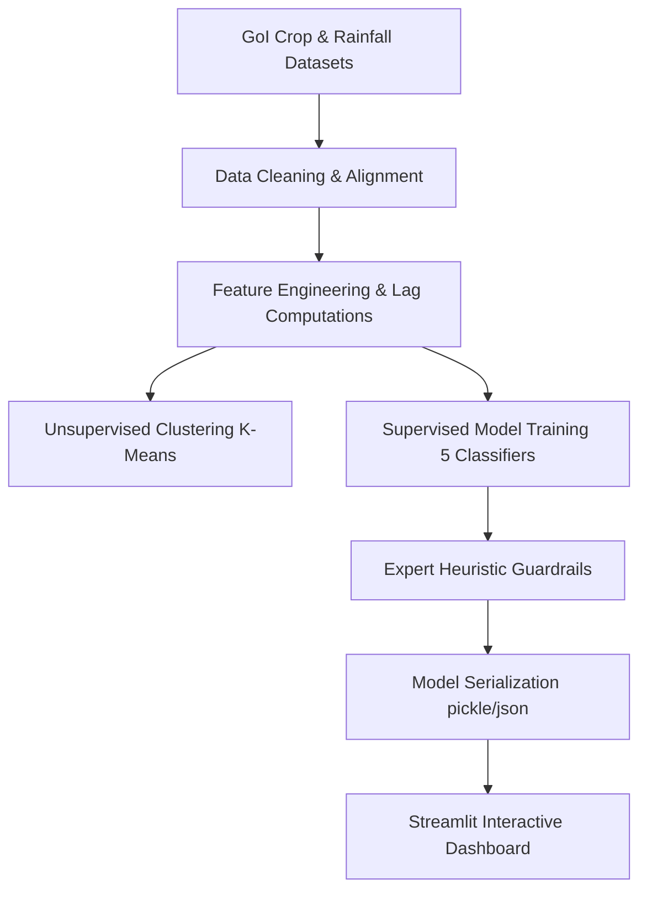

# Farmer Decision Intelligence: Predicting Crop Switching Behaviour in Andhra Pradesh
## Project Report

---

## 1. Introduction and Motivation

Agriculture in Andhra Pradesh (AP) is the backbone of the state’s rural economy, supporting over 60% of its population. However, it is highly vulnerable to climate fluctuations (e.g., erratic monsoons, drought cycles, flash floods) and market volatility. To adapt, farmers frequently engage in **crop switching**—changing their primary crop from one season to the next to mitigate environmental stress or maximize profit.

Predicting crop switching behaviour is of critical importance:
*   **For Farmers:** Understanding risk patterns helps them make informed, data-driven decisions rather than reactive crop choices that could lead to crop failure or market saturated oversupply.
*   **For Policymakers:** Early warning systems allow the government to optimize seed distribution, manage irrigation, organize agricultural subsidies, and stabilize local supply chains.

This project introduces a **Decision Intelligence Platform** utilizing historical datasets (1997–2014) to forecast crop switching risks, combine them with expert agricultural overrides, and present them through an interactive web-based advisory simulator.

---

## 2. Problem Statement

The objective of this project is to build an end-to-end Machine Learning pipeline that predicts whether a district-crop-season combination is at risk of **crop switching** in the upcoming year.

*   **Input Features:** Scaling variables (cultivated area, crop production, crop yield), meteorological parameters (annual rainfall, rainfall deviation from normal), and spatial-temporal identifiers (district, season, year).
*   **Expected Outcome:** A binary classifier that predicts `Switched` ($1$ if the crop cultivated for a district-season changes in the subsequent year, $0$ otherwise), along with a calibrated risk probability ($0\%$ to $100\%$) and tailored recommendations.
*   **Heuristic Guardrails:** Integration of expert agricultural rules to guarantee high-risk alerts during severe weather anomalies (droughts/floods), ensuring safety where historical data may be sparse.

---

## 3. Dataset Understanding

The platform is grounded in real-world historical records from the Government of India (GoI) spanning 1997 to 2014. It merges agricultural statistics with meteorological datasets:

### 3.1 Dataset Sources
1.  **Crop Production Statistics:** District-level historical records of crop varieties, seasons, cultivated area (hectares), and crop production (metric tonnes).
2.  **Rainfall in India (1901–2015):** Subdivision and district-level monthly and annual rainfall data.
3.  **Districtwise Normal Rainfall:** Reference baseline averages representing the "normal" expected rainfall for each district.

### 3.2 Dataset Structure & Characteristics
After cleaning, filtering for Andhra Pradesh, and aligning the variables, the final preprocessed dataset contains **688 high-fidelity records** with the following key attributes:

| Field Name | Type | Description |
| :--- | :--- | :--- |
| `District_Name` | Categorical | The district in Andhra Pradesh (13 districts represented) |
| `Crop_Year` | Integer | Chronological year of observation (1997–2014) |
| `Season` | Categorical | Season of cultivation (`Kharif`, `Rabi`, `Whole Year`) |
| `Crop` | Categorical | Primary crop grown (68 crop types represented) |
| `Area` | Float | Land area under cultivation (in hectares) |
| `Production` | Float | Crop output (in metric tonnes) |
| `Yield` | Float | Cultivation productivity ($\text{Production} / \text{Area}$) |
| `annual_rainfall` | Float | Annual rainfall received (in mm) |
| `rainfall_deviation`| Float | Deviation from normal district rainfall (in mm) |
| `Switched` | Binary | Target label ($1$ if the crop changes in the next year, $0$ otherwise) |

### 3.3 Key Exploratory Insights
*   **Imbalance:** The dataset exhibits a **20.06% overall crop switching rate**, showing a natural class imbalance (4:1 ratio of *No Switch* to *Switch*).
*   **District Volatility:** **Kuddapah** is identified as the most volatile district with the highest frequency of switching events, while **Chittoor** is the most stable.
*   **Crop Susceptibility:** **Sugarcane** is the crop most frequently switched away from, likely due to its high water footprint in drought-prone years.

---

## 4. Methodology

The end-to-end framework follows a systematic, data-scientific workflow:

### 4.1 Feature Engineering
To capture historical momentum and scale differences, the feature space was expanded:
1.  **Log Transforms:** Applied to highly skewed scaling variables:
    $$\text{Area\_log} = \log(1 + \text{Area}), \quad \text{Production\_log} = \log(1 + \text{Production}), \quad \text{Yield\_log} = \log(1 + \text{Yield})$$
2.  **Lag Features:** Generated to represent year-over-year momentum:
    *   `Prev_Area`: Cultivated area in the previous year.
    *   `Prev_Yield`: Crop yield in the previous year.
    *   `Area_change`: $\text{Area} - \text{Prev\_Area}$
    *   `Yield_change`: $\text{Yield} - \text{Prev\_Yield}$
3.  **Interaction Terms:** Interacted scale and climate features to capture combined stress:
    *   `Area_x_Rain` = $\text{Area} \times \text{annual\_rainfall}$
    *   `Yield_x_Rain` = $\text{Yield} \times \text{rainfall\_deviation}$

### 4.2 Clustering (Unsupervised Insights)
A **K-Means clustering** ($k=3$) was performed to segment districts by structural risk profiles, grouping them into low, medium, and high vulnerability zones based on switching rates, mean cultivated area, and average rainfall.

### 4.3 Supervised Modeling
Five machine learning algorithms were trained and compared. To address the class imbalance, models were evaluated using the **F1-score** and trained with class weight adjustments:
*   *Decision Tree Classifier*
*   *Random Forest Classifier*
*   *Gradient Boosting Classifier*
*   *Logistic Regression*
*   *K-Nearest Neighbors (KNN)*

### 4.4 Expert Heuristic Guardrails
To handle out-of-distribution weather and ensure safety, heuristic rules override predictions under extreme conditions:
*   **Severe Drought Override:** If $\text{Expected Rainfall} < 70\% \text{ of normal}$, risk probability is forced to $\ge 75\%$.
*   **Moderate Drought Override:** If $\text{Expected Rainfall} < 85\% \text{ of normal}$, risk probability is forced to $\ge 50\%$.
*   **Flood Override:** If $\text{Expected Rainfall} > 140\% \text{ of normal}$, risk probability is forced to $\ge 55\%$.

---

## 5. Implementation Details

### 5.1 Technology Stack
*   **Core Logic:** Python 3.14
*   **Data Processing:** Pandas, NumPy
*   **Machine Learning:** Scikit-Learn (Model comparison, K-Means, scaling, encoding)
*   **Interactive Visualization:** Plotly (Express & Graph Objects)
*   **Web Framework:** Streamlit (v1.58.0)

### 5.2 Application Code Architecture
The implementation is divided into two primary scripts:
1.  `AP_Crop_Switching.py`: Handles raw data loading, cleaning, feature engineering, K-Means clustering, model training, cross-validation scoring, and serializes the trained model assets (`model_assets.pkl`) and metrics (`model_performance.json`).
2.  `app.py`: Launches the interactive Streamlit user interface, hosting five dedicated workspace tabs:
    *   **Simulator:** Real-time prediction interface with parameter sliders and a gauge meter.
    *   **Overview:** Line charts and donut charts representing temporal switching rates.
    *   **Districts:** Bar charts and boxplots displaying geographical vulnerability.
    *   **Model:** Detailed metrics comparison and interactive horizontal bar charts for feature importances.
    *   **Data:** Sortable, styled datatable highlighting risk levels in real-time.

---

## 6. Results and Discussions

### 6.1 Model Performance Comparison
Models were evaluated on a $25\%$ unseen holdout set. The F1-score was used as the primary selection metric due to the ~20% minority class representation.

| Model Name | Test Accuracy | F1 Score (Minority) | 5-Fold Cross-Validation F1 |
| :--- | :---: | :---: | :---: |
| **Gradient Boosting** | **90.16%** | **0.7600** | **0.7383** |
| Random Forest | 90.98% | 0.7556 | 0.6554 |
| Decision Tree | 79.51% | 0.6032 | 0.5304 |
| Logistic Regression | 59.02% | 0.4048 | 0.4600 |
| KNN | 76.23% | 0.2927 | 0.3372 |

> [!TIP]
> **Gradient Boosting** was selected as the production model. By sequentially optimizing regression trees on pseudo-residuals, it generalized much better to the feature interactions and class boundaries than bagging methods like Random Forest, achieving a superior **0.7383 Cross-Validation F1**.

### 6.2 Feature Importance Analysis
Using the Gradient Boosting model's split-based importances, the top predictive features were identified:

1.  **`Yield_change` (29.59%):** Year-over-year change in yield is the strongest driver, indicating that consecutive poor yields motivate farmers to switch crops.
2.  **`Prev_Area` (21.02%):** Cultivation scale in the previous year acts as a proxy for financial capacity and capacity constraints.
3.  **`Prev_Yield` (10.58%):** Base productivity of the prior crop cycle.
4.  **`Area_change` (9.81%):** Sudden expansions or contractions of crop land.

### 6.3 Strengths & Limitations
*   **Strengths:**
    *   **Hybrid Intelligence:** The system seamlessly merges statistical machine learning with heuristic farming rules (guardrails) for climate extremes.
    *   **Lag Dynamics:** The introduction of temporal lag features successfully captures farmer inertia.
    *   **Interactive Visualizations:** Fully responsive design built with dark-mode Plotly components.
*   **Limitations:**
    *   **Market Price Volatility:** The current model lacks crop price indices and market demand statistics, which heavily influence farmer decisions.
    *   **Data Temporal Boundary:** Historical scope of the merged GoI dataset ends at 2014.

---

## 7. Conclusion

This project successfully demonstrates a production-grade **Farmer Decision Intelligence Platform** optimized for predicting crop switching risks in Andhra Pradesh. By building historical lag variables and combining a highly performant **Gradient Boosting Classifier** (90.16% test accuracy) with expert meteorological guardrails, the system delivers reliable risk forecasts. 

Deployed via Streamlit, the platform provides actionable insights that bridge the gap between complex machine learning and actual field-level agricultural planning.

---

## 8. References

1.  **Agricultural Production Data:** Open Government Data (OGD) Platform India (data.gov.in) — *District-wise crop production statistics (1997-2014)*.
2.  **Rainfall Records:** India Meteorological Department (IMD), Government of India — *Subdivision-wise monthly and annual rainfall data*.
3.  **Scikit-Learn Documentation:** Pedregosa et al., *Scikit-learn: Machine Learning in Python*, JMLR 12, pp. 2825-2830, 2011.
4.  **Streamlit API Reference:** Streamlit Developers, *API Reference for Layouts, Forms, and Elements (v1.58.0)*.
