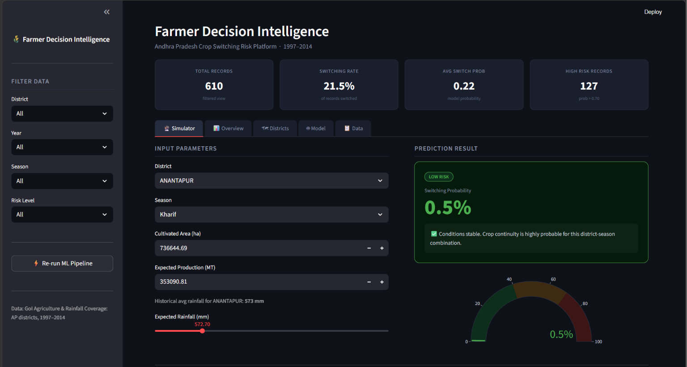
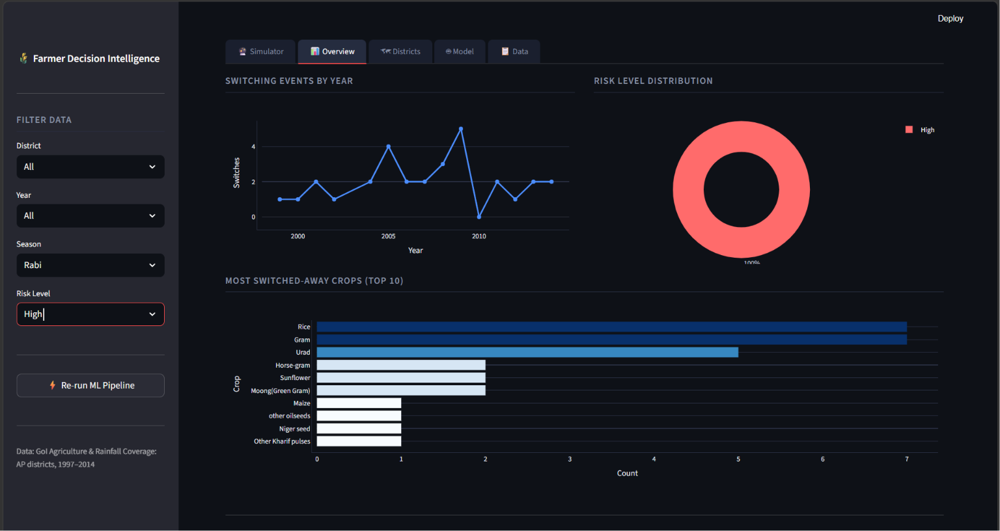
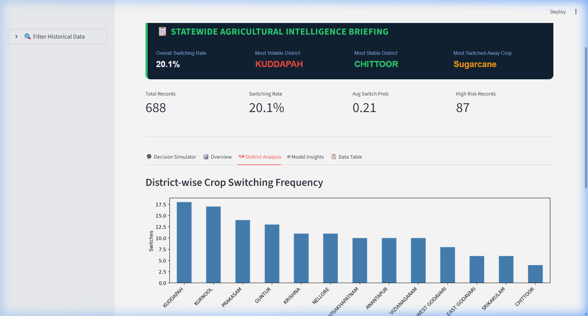

# Farmer Decision Intelligence: Predicting Crop Switching Behaviour in Andhra Pradesh

An end-to-end data intelligence and machine learning pipeline to predict crop switching risk levels and provide action-oriented recommendations for farmers in Andhra Pradesh, complete with an interactive Streamlit dashboard.

---

## 📋 About
Agriculture in Andhra Pradesh is highly susceptible to climate fluctuations, resource availability, and economic volatility. Farmers frequently decide to switch their primary crop from one season to the next to mitigate risk or optimize yields. 

This project builds a **Decision Intelligence platform** that:
- Identifies historical crop switching behavior across Andhra Pradesh districts (1997–2014) using GoI crop and rainfall datasets.
- Trains multiple machine learning classifiers to predict switching decisions.
- Introduces **expert agricultural heuristic guardrails** (drought/flood overrides) to handle extreme out-of-distribution weather anomalies.
- Deploys an interactive dashboard containing a **Live Farmer Decision Simulator** that predicts switching probability and displays tailored advisor recommendations.

---

## 🚀 How to Run

### 1. Install Dependencies
Make sure you have Python installed, then run:
```bash
pip install -r requirements.txt
```

### 2. Execute ML Pipeline (Optional)
The pipeline runs automatically in the background on app startup if output assets are missing. To run it manually:
```bash
python AP_Crop_Switching.py
```

### 3. Launch the Streamlit App
Start the interactive dashboard locally:
```bash
streamlit run app.py
```

---

## 📊 Key Insights & Model Performance

### Machine Learning Model Comparison (5-fold CV)
The pipeline evaluates multiple models on the processed dataset. Below is the performance summary:

| Model | Test Accuracy | F1 Score | CV Accuracy (5-fold) |
|---|---|---|---|
| **Logistic Regression** | 80.00% | 0.1875 | **78.74%** |
| **Random Forest** | 80.00% | 0.3810 | 75.35% |
| **KNN** | 76.15% | 0.3111 | 71.96% |
| **Decision Tree** | 79.23% | 0.5263 | 61.03% |

### Key Agricultural Findings
* **Most Volatile District**: **KUDDAPAH** shows the highest rate of crop switching events.
* **Most Stable District**: **CHITTOOR** shows the highest rate of crop continuity.
* **Highest Volatility Crop**: **Sugarcane** is the crop most frequently switched away from.
* **Top Predictive Feature**: Cultivation **Area** is the strongest predictor of whether a farmer will switch crops, followed by crop **Production** and **Yield**.
* **Weather Anomalies**: Extreme rainfall deviations trigger immediate switching risk (handled via built-in expert rules to override machine learning limitations during severe droughts or floods).

---

## 🖼️ Dashboard Walkthrough & Gallery

### A) Interactive Decision Simulator (Farmer Tool)
Allows users to select a district and season. The application dynamically queries the historical data to populate the average area and production values as defaults. When a user runs the simulation, the backend model processes inputs through custom agricultural rules (drought and excess rainfall guardrails) to output real-time risk levels and recommendations.


### B) Historical Overview Dashboard
Visualizes historical crop switching frequencies over time, risk level splits, and the most common crops that farmers have switched away from in Andhra Pradesh.


### C) District Analysis & Volatility
Shows district-level switching counts, boxplot analyses correlating annual rainfall with crop switching behavior, and tables ranking the highest-risk spatial-temporal combinations.

