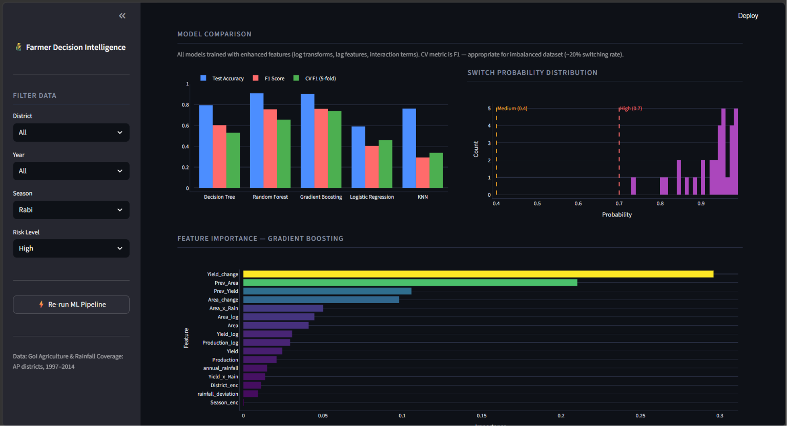

# Farmer Decision Intelligence: Predicting Crop Switching Behaviour in Andhra Pradesh

An end-to-end machine learning pipeline to predict crop switching risk and provide action-oriented recommendations for farmers in Andhra Pradesh, with an interactive Streamlit dashboard.

---

## 📋 About

Agriculture in Andhra Pradesh is highly susceptible to climate fluctuations, resource availability, and economic volatility. Farmers frequently switch their primary crop between seasons to mitigate risk or optimize yields.

This project builds a **Decision Intelligence platform** that:
- Identifies historical crop switching behaviour across AP districts (1997–2014) using GoI crop and rainfall datasets
- Engineers enhanced features including log transforms, lag features, and interaction terms
- Trains and compares 5 ML classifiers with `class_weight='balanced'` to handle natural class imbalance
- Introduces **expert agricultural heuristic guardrails** (drought/flood overrides) for extreme weather anomalies
- Deploys an interactive dashboard with a **Live Farmer Decision Simulator**

---

## 🗂️ Project Structure

```
├── AP_Crop_Switching.py             # Full ML pipeline
├── app.py                           # Streamlit interactive dashboard
├── requirements.txt
├── datasets/
│   ├── crop_production.csv
│   ├── rainfall_in_india_1901-2015.csv
│   └── districtwise_rainfall_normal.csv
├── plots/                           # 12 auto-generated EDA & model plots
├── dashboard_output.csv             # Generated by pipeline
├── model_assets.pkl                 # Trained model + encoders
└── model_performance.json           # Metrics loaded dynamically into dashboard
```

---

## 🚀 How to Run

### 1. Install Dependencies
```bash
pip install -r requirements.txt
```

### 2. Run the ML Pipeline
```bash
python AP_Crop_Switching.py
```

### 3. Launch the Streamlit Dashboard
```bash
streamlit run app.py
```
> The pipeline also auto-runs on first startup if output files are missing.

---

## 📊 Model Performance

### Enhanced Feature Set
Beyond raw crop and rainfall data, the following features are engineered:
- **Log transforms** — `Area_log`, `Production_log`, `Yield_log` (reduce skew from large values)
- **Lag features** — `Prev_Area`, `Prev_Yield`, `Area_change`, `Yield_change` (year-over-year comparison)
- **Interaction terms** — `Area_x_Rain`, `Yield_x_Rain` (combined effect of scale + climate)

### Model Comparison (CV metric: F1-score, 5-fold)

| Model | Test Accuracy | F1 Score | CV F1 (5-fold) |
|---|---|---|---|
| **Gradient Boosting** | **92.62%** | **0.8235** | **0.7274** |
| Random Forest | 87.70% | 0.6939 | 0.6918 |
| Decision Tree | 85.25% | 0.6786 | 0.5187 |
| Logistic Regression | 63.93% | 0.3889 | 0.4693 |
| KNN | 76.23% | 0.2564 | 0.3314 |

> **Why CV metric is F1, not accuracy:** The dataset has ~20% switching rate (class imbalance). A model that always predicts "No Switch" would get 80% accuracy but zero F1. F1 is the correct metric here.

> **Why Gradient Boosting wins:** It builds trees sequentially — each tree corrects the errors of the previous one. This makes it especially effective on tabular data with class imbalance, unlike Random Forest which builds trees independently.

### Key Agricultural Findings

| Finding | Value |
|---|---|
| Overall Switching Rate | ~20% |
| Most Volatile District | KUDDAPAH |
| Most Stable District | CHITTOOR |
| Most Switched-Away Crop | Sugarcane |
| Top Predictive Feature | Area_change (year-over-year area shift) |

- **Area_change** being the top feature means sudden drops or spikes in cultivation area are the strongest signal a farmer is about to switch
- **Lag features** (Prev_Area, Prev_Yield) contributed significantly — confirming that historical context matters more than current-year values alone

---

## 🖼️ Dashboard Features

| Tab | Content |
|---|---|
| 🔮 Decision Simulator | Live prediction — select district, season, rainfall. Returns risk card + probability gauge |
| 📊 Overview | Year-wise switching trend, risk distribution, most switched crops |
| 🗺 District Analysis | District switching frequency, rainfall vs switching, top 10 high-risk combinations |
| 🤖 Model Insights | Dynamic model comparison table, probability distribution, feature importance |
| 📋 Data Table | Full filtered dataset with CSV download |

### 📸 Dashboard Screenshots & Walkthrough

#### 🔮 1. Live Decision Simulator
Predicts crop switching risk in real-time. Features input parameter tuning (District, Season, Cultivated Area, Expected Production, Expected Rainfall) with instant risk classification and a dynamic probability gauge.


#### 📊 2. Overview Dashboard
Provides a macro-level overview of switching events over time (1997–2014), the overall distribution of risk levels, and a chart highlighting the top 10 most switched-away crops (e.g., Rice, Gram, Urad).


#### 🗺️ 3. District Analysis
Visualizes geographic patterns, comparing total switching events by district, box plots of annual rainfall vs. switching behavior, and details on high-risk district-season combinations.


#### 🤖 4. Model Insights
Presents the model evaluation suite, displaying test accuracy, F1-scores, and cross-validation F1-scores across models (Gradient Boosting, Random Forest, etc.), plus feature importances and probability distributions.


---

## 🛠️ Tech Stack

- **Python** — pandas, numpy, scikit-learn, matplotlib, seaborn
- **ML Models** — Decision Tree, Random Forest, Gradient Boosting, Logistic Regression, KNN
- **Dashboard** — Streamlit

---

*Project: Farmer Decision Intelligence | VINS Internship — IIT Ropar | Data: Government of India (1997–2014)*
